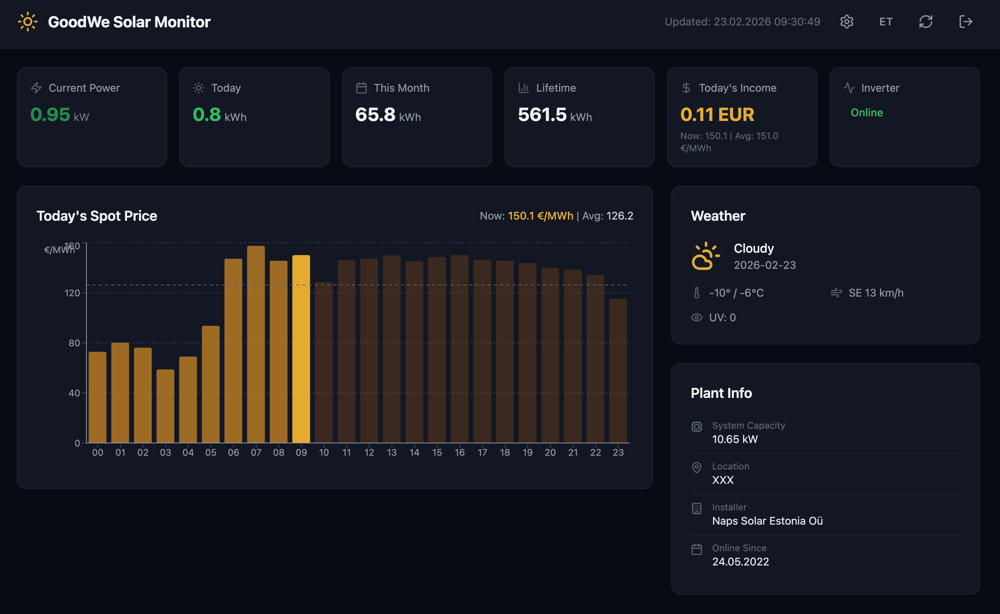

# GoodWe Solar Monitor

A static single-page web app for monitoring a GoodWe solar inverter in real-time. Connects to the SEMS Portal API and Elering Nord Pool API through a CORS proxy, displaying live production data, spot electricity prices, weather, and inverter details.

No backend required — runs entirely in the browser, hosted on GitHub Pages.



## Features

- Real-time power output with auto-refresh (5 min day / 30 min night)
- Today, monthly, and lifetime generation stats
- Today's hourly spot price chart (Nord Pool via Elering API)
- Spot price income estimation using sunrise/sunset-aware daylight hours
- Weather conditions from SEMS API (translated to Estonian/English)
- Inverter details (AC phases, DC strings, temperature)
- Dark theme, responsive layout
- Bilingual UI — Estonian (default) and English, switchable via header toggle
- Login with SEMS Portal credentials, optional "remember me"
- Silent token refresh every 25 minutes

## Prerequisites

Before you begin, you'll need:

1. **A GoodWe inverter** registered on [SEMS Portal](https://www.semsportal.com/)
2. Your **SEMS Portal credentials** (email + password)
3. Your **Power Station ID** (UUID) — find it in SEMS Portal → Plant Settings
4. A **Cloudflare account** (free tier is fine) to deploy the CORS proxy

## Set Up Your Own Instance

### Step 1: Deploy the CORS Proxy (Cloudflare Worker)

The app cannot call the SEMS and Elering APIs directly from the browser due to CORS restrictions. A small Cloudflare Worker acts as a proxy.

1. Go to [Cloudflare Dashboard](https://dash.cloudflare.com/) → Workers & Pages → Create Worker
2. Name it something like `sems-proxy`
3. Paste the following code and click Deploy:

```javascript
export default {
  async fetch(request) {
    // Handle CORS preflight
    if (request.method === 'OPTIONS') {
      return new Response(null, {
        headers: {
          'Access-Control-Allow-Origin': '*',
          'Access-Control-Allow-Methods': 'POST, OPTIONS',
          'Access-Control-Allow-Headers': 'Content-Type',
        },
      })
    }

    if (request.method !== 'POST') {
      return new Response('Method not allowed', { status: 405 })
    }

    try {
      const { url, headers, body, method } = await request.json()

      if (!url) {
        return new Response(JSON.stringify({ error: 'Missing url' }), {
          status: 400,
          headers: { 'Content-Type': 'application/json' },
        })
      }

      const fetchOptions = {
        method: method || 'POST',
        headers: headers || {},
      }

      // Only include body for POST requests
      if (fetchOptions.method === 'POST' && body) {
        fetchOptions.body = JSON.stringify(body)
      }

      const response = await fetch(url, fetchOptions)
      const data = await response.text()

      return new Response(data, {
        status: response.status,
        headers: {
          'Content-Type': 'application/json',
          'Access-Control-Allow-Origin': '*',
        },
      })
    } catch (err) {
      return new Response(JSON.stringify({ error: err.message }), {
        status: 500,
        headers: {
          'Content-Type': 'application/json',
          'Access-Control-Allow-Origin': '*',
        },
      })
    }
  },
}
```

4. Note your worker URL (e.g. `https://sems-proxy.<your-subdomain>.workers.dev/`) — you'll enter this on the login screen

> **Tip:** Cloudflare Workers free tier allows 100,000 requests/day — more than enough for personal use.

### Step 2: Fork and Configure the App

1. Fork this repository
2. Update `vite.config.js` — change the `base` path to match your repo name:
   ```javascript
   export default defineConfig({
     // ...
     base: '/your-repo-name/',
   })
   ```
3. Enable GitHub Pages in your repo settings: Settings → Pages → Source → GitHub Actions

### Step 3: Deploy

Push to `main` and GitHub Actions will automatically build and deploy to GitHub Pages.

The deployment workflow (`.github/workflows/deploy.yml`) handles everything: install → build → upload to GitHub Pages.

Alternatively, run locally:

```bash
npm install
npm run dev
```

### Step 4: Log In

Open your deployed app and enter:
- **Email** — your SEMS Portal email
- **Password** — your SEMS Portal password
- **Power Station ID** — the UUID from SEMS Portal → Plant Settings
- **CORS Proxy URL** — your Cloudflare Worker URL from Step 1

## Tech Stack

- React 19.2
- Vite 7
- Tailwind CSS 4
- Recharts 3
- Lucide React (icons)
- Cloudflare Worker (CORS proxy)

## Internationalization (i18n)

The app supports Estonian and English. Estonian is the default language. A language toggle button (EN/ET) is available in the header and on the login screen. The selected language is persisted in `localStorage`.

Translation files are located in `src/i18n/`:
- `et.js` — Estonian translations
- `en.js` — English translations

Weather conditions from the API are also translated via keyword matching.

## Development

```bash
npm install
npm run dev          # Dev server at localhost:5173
npm run build        # Production build to dist/
npm run preview      # Preview production build
```

Or with Docker:

```bash
docker compose up --build
```

## How the Proxy Works

The app sends all API requests as `POST` to your proxy URL with a JSON body:

```json
{
  "url": "https://eu.semsportal.com/api/v2/...",
  "headers": { "Content-Type": "application/json", "Token": "..." },
  "body": { ... }
}
```

For Elering (GET requests):

```json
{
  "url": "https://dashboard.elering.ee/api/nps/price?start=...&end=...",
  "method": "GET"
}
```

The proxy forwards the request and returns the response with CORS headers added.

## License

MIT
